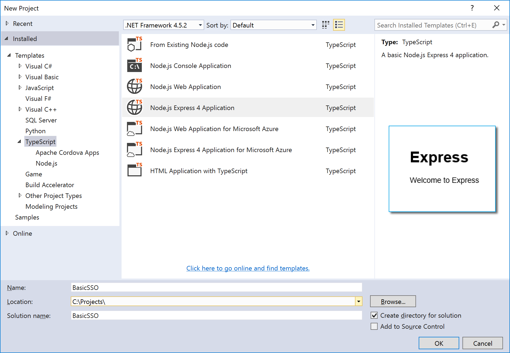
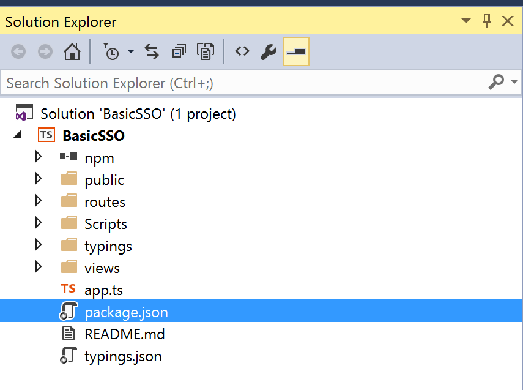
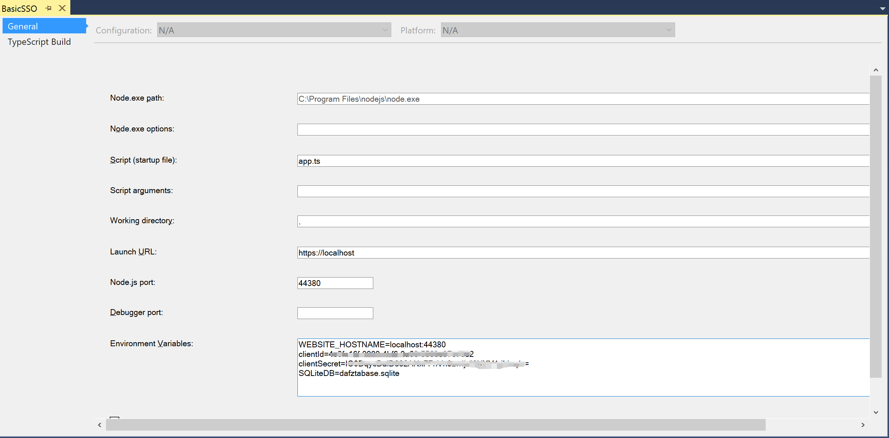
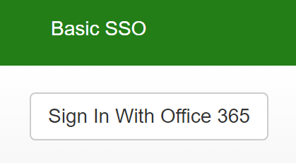
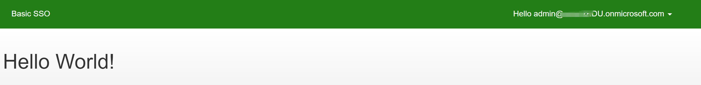

# Basic SSO - Angular/Node version

In this sample we show you how to integrate Azure Active Directory(Azure AD) to provide secure sign in and authorization. 

The code in the following sections is part of the full featured Angular app and presented as a new project for clarity and separation of functionality.

**Table of contents**
* [Register the application in Azure Active Directory](#register-the-application-in-azure-active-directory)
* [Prerequisites](#prerequisites)
* [Build and debug locally](#build-and-debug-locally)


## Register the application in Azure Active Directory

1. Sign in to the Azure portal: [https://portal.azure.com/](https://portal.azure.com/).

2. Choose your Azure AD tenant by selecting your account in the top right corner of the page.


3. Click **Azure Active Directory** -> **App registrations** -> **+Add**.

4. Input a **Name**, and select **Web app / API** as **Application Type**.

   Input **Sign-on URL**: https://localhost:44377/

   

   Click **Create**.

5. Once completed, the app will show in the list.

   

6. Click it to view its details. 

   

7. Click **All settings**, if the setting window did not show.

     

     Copy aside **Application ID**, then Click **Save**.

   * Click **Reply URLs**, add the following URL into it.

     [https://localhost:44380/auth/openid/return](https://localhost:44380/auth/openid/return)

     ​

   * Click **Required permissions**. Add the following permissions:

     | API                            | Application Permissions | Delegated Permissions         |
     | ------------------------------ | ----------------------- | ----------------------------- |
     | Windows Azure Active Directory |                         | Sign in and read user profile |

     

   * Click **Keys**, then add a new key

     

     Click **Save**, then copy aside the **VALUE** of the key. 

   Close the Settings window.


## Prerequisites

- Visual Studio 2015 (any edition), [Visual Studio 2015 Community](https://go.microsoft.com/fwlink/?LinkId=691978&clcid=0x409) is available for free.

- [TypeScript for Visual Studio 2015](https://www.microsoft.com/en-us/download/details.aspx?id=48593)

- [Node.js v6.11.2](https://nodejs.org/en/download/)

- [Node.js Tools 1.3](https://github.com/Microsoft/nodejstools/releases/tag/v1.3)

- [Git](https://git-scm.com/download/win)

  Familiarity with Node.js, TypeScript, Angular and web services.

  ​

## Build and debug locally

1. Open Visual Studio 2015 as administrator, first we will create an empty project.

2. Click **File**->**New**->**Project**, select **Node.js Express4 Application**, create a web project named **BasicSSO**.

   

3. Open **package.json**  file after create project successfully.

   

4. Use the following packages to replace the **dependencies** section.

   ```xml
   "dependencies": {
       "@angular/common": "~4.3.4",
       "@angular/compiler": "~4.3.4",
       "@angular/core": "~4.3.4",
       "@angular/forms": "~4.3.4",
       "@angular/http": "~4.3.4",
       "@angular/platform-browser": "~4.3.4",
       "@angular/platform-browser-dynamic": "~4.3.4",
       "@angular/router": "~4.3.4",
       "@angular/upgrade": "~4.3.4",
       "adal-node": "^0.1.22",
       "angular-in-memory-web-api": "~0.3.0",
       "bluebird": "^3.4.6",
       "body-parser": "^1.15.2",
       "bootstrap": "3.3.7",
       "cookie-parser": "^1.4.3",
       "cookie-session": "^2.0.0-alpha.2",
       "core-js": "^2.4.1",
       "crypto-js": "^3.1.9-1",
       "express": "^4.14.0",
       "gulp": "github:gulpjs/gulp#4.0",
       "gulp-angular-embed-templates": "^2.3.0",
       "gulp-series": "^1.0.2",
       "gulp-typescript": "^3.1.3",
       "jsonwebtoken": "^7.2.1",
       "morgan": "^1.7.0",
       "passport": "^0.3.2",
       "passport-azure-ad": "^3.0.3",
       "rxjs": "5.0.1",
       "sequelize": "^3.27.0",
       "serve-favicon": "^2.3.2",
       "sqlite3": "^3.1.9",
       "stylus": "^0.54.5",
       "systemjs": "0.19.40",
       "systemjs-builder": "^0.15.34",
       "typescript": "^2.1.4",
       "zone.js": "^0.8.4"
     },
   ```

5. Add the following **devDependencies** section under the **dependencies** section.

   ```xml
     "devDependencies": {
       "@types/bcryptjs": "2.3.30",
       "@types/bluebird": "3.0.37",
       "@types/body-parser": "0.0.33",
       "@types/cookie-parser": "1.3.30",
       "@types/cookie-session": "2.0.32",
       "@types/crypto-js": "3.1.32",
       "@types/express": "4.0.34",
       "@types/express-serve-static-core": "4.0.40",
       "@types/jsonwebtoken": "7.2.0",
       "@types/morgan": "1.7.32",
       "@types/passport": "0.3.1",
       "@types/sequelize": "4.0.39",
       "@types/serve-favicon": "2.2.28",
       "@types/superagent": "2.0.36"
     }
   ```

6. Use the following **scripts** section to replace **scripts** section.

   ```xml
     "scripts": {
       "gulp": "gulp"
     },
   ```

7. Select **npm**, right-click and select **Install Missing npm Packages**.

8. Delete the following folders and files from project.

   - **Typings** ,  **Scripts** ,  **public** and **Views** folders
   - **routes/index.ts** ,  **routes/user.ts** files
   - **typings.json** file
   - **README.md** file

9. Select **BasicSSO**, add a new folder named **app**.

10. Select **app** folder, add the following new files into **app** folder.

   - **app.component.template.html , app.component.ts**
   - **login.component.template.html , login.component.ts**
   - **app.module.ts, app.routing.ts**
   - **authHelper.ts**
   - **site.css**
   - **main.ts**

11. Open **app.component.template.html** file, delete all code and add the following code into it.

    ```html
    <router-outlet></router-outlet>
    ```

12. Open **app.component.ts** file, delete all code and add the following code into it.

    ```typescript
    import { Component, OnInit } from '@angular/core';
    import { AuthHelper } from "./authHelper";

    @Component({
        moduleId: module.id,
        selector: 'app',
        templateUrl: 'app.component.template.html'
    })

    export class AppComponent implements OnInit {
        constructor(
            private auth: AuthHelper) {
        }
        ngOnInit() {
        }
    }
    ```

13. Open **login.component.template.html** file, delete all code and add the following code into it.

    ```html
    <div class="navbar navbar-inverse navbar-fixed-top">
        <div class="container">
            <div class="navbar-header">
                <button type="button" class="navbar-toggle" data-toggle="collapse" data-target=".navbar-collapse">
                    <span class="icon-bar"></span>
                    <span class="icon-bar"></span>
                    <span class="icon-bar"></span>
                </button>
                <a class="navbar-brand" href="/">Basic SSO</a>
            </div>
            <div class="navbar-collapse">
                <ul class="nav navbar-nav"></ul>
                <form class="navbar-right" id="logoutForm" method="post">
                    <div class="userinfo">
                        <a href="javascript:void(0);" id="userinfolink" (click)="showContextMenu(this)">
                            <span *ngIf="fullName">Hello {{fullName}}</span>
                            <span *ngIf="fullName" class="caret" id="caret" [class.transformcaret]="ifShowContextMenu"></span>
                        </a>
                    </div>
                    <div class="" id="userinfoContainer" [hidden]="!ifShowContextMenu">
                        <div class="popuserinfo">
                            <div class="subitem">
                                <a href="javascript:void(0);" (click)="doLogOff(this)">Log off</a>
                            </div>
                        </div>
                    </div>
                </form>
            </div>
        </div>
    </div>
    <div class="containerbg">
        <div class="container body-content">
            <div class="loginbody">
                <br />
                <div class="row" [hidden]="isLogin()">
                    <p>
                        <button type="submit" class="btn btn-default btn-ms-login" id="OpenIdConnect" name="provider" value="OpenIdConnect" title="Log in using your Microsoft Work or school account" (click)="login()">Sign In With Office 365</button>
                    </p>
                </div>
                <div class="row" [hidden]="!isLogin()">
                    <h1>Hello World!</h1>
                </div>
            </div>
        </div>
    </div>
    ```

14. Open **login.component.ts** file, delete all code and add the following code into it.

    ```typescript
    import { Component, OnInit, OnDestroy, ViewEncapsulation } from '@angular/core';
    import { Router, NavigationEnd, ActivatedRoute } from '@angular/router';
    import { Inject } from '@angular/core';
    import 'rxjs/add/operator/filter';
    import 'rxjs/add/operator/map';
    import 'rxjs/add/operator/mergeMap';
    import { AuthHelper } from "./authHelper";

    @Component({
        encapsulation: ViewEncapsulation.None,
        moduleId: module.id,
        selector: 'loginform',
        templateUrl: 'login.component.template.html'
    })

    export class Login implements OnInit {
        ifShowContextMenu: boolean;
        fullName: string;

        constructor(
            private router: Router,
            private activatedRoute: ActivatedRoute,
            private auth: AuthHelper) {
        }

        ngOnInit() {
            this.ifShowContextMenu = false;
            this.initFullName();
        }

        login() {
            this.auth.login();
        }

        isLogin() {
            return this.auth.IsLogin();
        }

        doLogOff(): void {
            console.log('logOff');
            window.location.href = '/logout';
        }

        showContextMenu() {
            this.ifShowContextMenu = !(this.ifShowContextMenu);
        }

        initFullName() {
            if (this.auth.IsLogin()) {
                this.auth.getCurrentUser()
                    .subscribe((user) => {
                        this.fullName = user.email;
                    });
            }
        }
    }
    ```

15. Open **app.module.ts** file, delete all code and add the following code into it.

    ```typescript
    import { NgModule } from '@angular/core';
    import { FormsModule } from '@angular/forms';
    import { BrowserModule } from '@angular/platform-browser';
    import { HttpModule } from '@angular/http';
    import { AppComponent } from './app.component';
    import { Login } from './login.component';
    import { routing } from './app.routing';
    import { AuthHelper } from "./authHelper";

    @NgModule({
        imports: [BrowserModule, FormsModule, routing, HttpModule],
        declarations: [AppComponent, Login],
        bootstrap: [AppComponent],
        providers: [
            AuthHelper
        ]
    })

    export class AppModule {
    }
    ```

16. Open **app.routing.ts** file, delete all code and add the following code into it.

    ```typescript
    import { ModuleWithProviders } from '@angular/core';
    import { Routes, RouterModule } from '@angular/router';
    import { Login } from './login.component';

    export const appRoutes: Routes = [
        { path: '**', component: Login }
    ];

    export const routing: ModuleWithProviders = RouterModule.forRoot(appRoutes);
    ```

17. Open **authHelper.ts** file, delete all code and add the following code into it.

    ```typescript
    import { Injectable, Inject } from "@angular/core";
    import { Http, Headers, Response } from '@angular/http';
    import { Router, NavigationEnd, ActivatedRoute } from '@angular/router';
    import { Observable, ReplaySubject } from 'rxjs/Rx';

    @Injectable()
    export class AuthHelper {

        private meAPIUrl = 'api/me';
        constructor(
            private router: Router,
            private _http: Http) {
        }

        public IsLogin(): boolean {
            var token = CookieHelper.get('authType');
            return token && token != "undefined";
        }

        public getCurrentUser() {
            return this._http.get(this.meAPIUrl + '?t=' + new Date().getTime(), {})
                .map((response: Response) => response.json());
        }

        login() {
            window.location.href = "/auth/login/o365";
        }
    }

    export class CookieHelper {

        public static check(name: string): boolean {
            name = encodeURIComponent(name);
            let regexp = new RegExp('(?:^' + name + '|;\\s*' + name + ')=(.*?)(?:;|$)', 'g');
            let exists = regexp.test(document.cookie);
            return exists;
        }

        public static get(name: string): string {
            if (CookieHelper.check(name)) {
                name = encodeURIComponent(name);
                let regexp = new RegExp('(?:^' + name + '|;\\s*' + name + ')=(.*?)(?:;|$)', 'g');
                let result = regexp.exec(document.cookie);
                return decodeURIComponent(result[1]);
            } else {
                return null;
            }
        }
    }
    ```

18. Open **site.css** file, delete all code and add the following code into it.

    ```style
    html{height:100%;}
    body {
        padding-top: 50px;
        padding-bottom: 20px;
        background-repeat: no-repeat;
        background-size: 100% 100%;
        height:100%;
    }
    a{cursor:pointer;}
    .containerbg{    background: linear-gradient(to bottom, white, #9e9e9e);height:auto; height: auto;
        min-height: 100%;padding-bottom:20px;
    }
    .body-content {
        padding-left: 15px;
        padding-right: 15px;
        height:100%;
    }
    .navbar-inverse{background-color:#237e17;border-color:#237e17;}
    .navbar-inverse .navbar-brand, 
    .navbar-inverse .navbar-nav > li > a {color:white;}
    .navbar-inverse .navbar-brand{font-size:14px}
    .navbar-collapse form{margin-bottom:0;}
    .navbar-right a{color:white;text-decoration:none;}
    .userinfo .caret{color:white;font-size:20px;    }
    .transformcaret{transform: rotate(180deg);}
    .userinfo{height:50px;line-height:50px;}
    .navbar-collapse{position:relative;}
    .popuserinfo{position:absolute;top:40px;z-index:999;background-color:white;padding:15px 0;
                 width:200px;border:1px solid #dedede;box-sizing: border-box;left:955px;}
    @-moz-document url-prefix() 
    {   
        .popuserinfo{left:955px;}
    }
    .subitem{float:left;width:100%;}
    .subitem a{color:black;text-decoration:none;width:100%;height:100%;display:block;padding:10px 0 10px 20px;}
    .subitem:hover{background-color:#237e17;color:white;}
    .subitem a:hover{color:white;}
    .container {width: 1170px;}
    ```

19. Open **main.ts** file, delete all code and add the following code into it.

    ```typescript
    import { platformBrowserDynamic } from '@angular/platform-browser-dynamic';
    import { AppModule } from './app.module';
    const platform = platformBrowserDynamic();
    platform.bootstrapModule(AppModule);
    ```

20. Select **BasicSSO** project folder, add the following new files into it.

    - **Index.html**
    - **constants.ts**
    - **gulpfile.js**
    - **systemjs.config.js**
    - **tsconfig.json**

21. Open **Index.html** file, delete all code and add the following code into it.

    ```html
    <html>
    <head>
        <title>Basic SSO</title>
        <meta charset="UTF-8">
        <meta name="viewport" content="width=device-width, initial-scale=1">
        <base href="/">
        <link href="https://maxcdn.bootstrapcdn.com/bootstrap/3.3.7/css/bootstrap.min.css" rel="stylesheet" />
        <link href="/app/site.css" rel="stylesheet" />
    </head>
    <body>
        <app></app>
        <script src="node_modules/core-js/client/shim.min.js"></script>
        <script src="node_modules/zone.js/dist/zone.js"></script>
        <script src="node_modules/systemjs/dist/system.src.js"></script>
        <script src="systemjs.config.js"></script>
        <script>
            System.import('app').catch(function (err) { console.error(err); });
        </script>
    </body>
    </html>
    ```

22. Open **constants.ts** file, delete all code and add the following code into it.

    ```typescript
    export class Constants {
        public static readonly Host: string = process.env.WEBSITE_HOSTNAME as string;
        public static readonly ClientId: string = process.env.clientId as string;
        public static readonly ClientSecret: string = process.env.clientSecret as string;
        public static readonly AADInstance: string = "https://login.microsoftonline.com/";
        public static readonly Authority: string = Constants.AADInstance + "common/";
        public static readonly IdentityMetadata: string = Constants.Authority + '.well-known/openid-configuration';
        public static readonly MSGraphResource: string = "https://graph.microsoft.com";
        public static readonly AADGraphResource: string = "https://graph.windows.net"; 
        public static readonly SQLiteDB: string = process.env.SQLiteDB as string;
    }
    ```

23. Open **gulpfile.js** file, delete all code and add the following code into it.

    ```javascript
    var gulp = require('gulp'),
        path = require('path'),
        Builder = require('systemjs-builder'),
        ts = require('gulp-typescript'),
        sourcemaps = require('gulp-sourcemaps'),
        embedTemplates = require('gulp-angular-embed-templates');

    var tsProject = ts.createProject('tsconfig.json');

    // build server side ts
    gulp.task('ts-server', () => {
        return gulp.src(['**/*.ts', '!app{,/**}', '!dist{,/**}', '!node_modules{,/**}'])
            .pipe(sourcemaps.init({
                loadMaps: true
            }))
            .pipe(tsProject())
            .pipe(sourcemaps.write('.'))
            .pipe(gulp.dest('./'));
    });

    // build and bundle client side ts and html
    var appDev = 'app';
    var appProd = 'dist';

    gulp.task('ts-client', () => {
        return gulp.src(appDev + '/**/*.ts')
            .pipe(embedTemplates({ sourceType: 'ts' }))
            .pipe(sourcemaps.init({
                loadMaps: true
            }))
            .pipe(tsProject())
            .pipe(sourcemaps.write('.'))
            .pipe(gulp.dest(appProd));
    });

    gulp.task('bundle-client', function () {
        var builder = new Builder('', 'systemjs.config.js');
        return builder
            .buildStatic(appProd + '/main.js', appProd + '/bundle.js', {
                minify: false, sourceMaps: true, encodeNames: false
            })
            .then(function () {
                console.log('Build complete');
            })
            .catch(function (err) {
                console.log('Build error');
                console.log(err);
            });
    });

    gulp.task('build', gulp.series(['ts-server', 'ts-client', 'bundle-client']));
    ```

24. Open **systemjs.config.js** file, delete all code and add the following code into it.

    ```javascript
    (function (global) {
        System.config({
            paths: {
                // paths serve as alias
                'npm:': 'node_modules/'
            },
            // map tells the System loader where to look for things
            map: {
                // our app is within the app folder
                app: 'app',
                // angular bundles
                '@angular/core': 'npm:@angular/core/bundles/core.umd.js',
                '@angular/common': 'npm:@angular/common/bundles/common.umd.js',
                '@angular/compiler': 'npm:@angular/compiler/bundles/compiler.umd.js',
                '@angular/platform-browser': 'npm:@angular/platform-browser/bundles/platform-browser.umd.js',
                '@angular/platform-browser-dynamic': 'npm:@angular/platform-browser-dynamic/bundles/platform-browser-dynamic.umd.js',
                '@angular/http': 'npm:@angular/http/bundles/http.umd.js',
                '@angular/router': 'npm:@angular/router/bundles/router.umd.js',
                '@angular/forms': 'npm:@angular/forms/bundles/forms.umd.js',
                // other libraries
                'rxjs': 'npm:rxjs',
                'angular-in-memory-web-api': 'npm:angular-in-memory-web-api/bundles/in-memory-web-api.umd.js'
            },
            // packages tells the System loader how to load when no filename and/or no extension
            packages: {
                app: {
                    main: './main.js',
                    defaultExtension: 'js'
                },
                rxjs: {
                    defaultExtension: 'js'
                },
                dist: {
                    defaultExtension: 'js'
                }
            }
        });
    })(this);
    ```

25. Open **tsconfig.json** file, delete all code and add the following code into it.

    ```typescript
    {
      "compilerOptions": {
        "target": "es5",
        "module": "commonjs",
        "moduleResolution": "node",
        "sourceMap": true,
        "emitDecoratorMetadata": true,
        "experimentalDecorators": true,
        "lib": [ "es2015", "dom" ],
        "noImplicitAny": false,
        "suppressImplicitAnyIndexErrors": true,
        "noStrictGenericChecks": true
      }
    }
    ```

26. Right-click project,  **Add ->New Folder** named **services**.

27. Right-click **services** folder,  add the following new files into it.

    - **appAuth.ts**
    - **dbContext.ts**
    - **tokenCacheService.ts**

28. Open **dbContext.ts** file, delete all code and add the following code into it to create token cache table.

    ```typescript
    import * as Sequelize from 'sequelize';
    import * as Promise from "bluebird";
    import { Constants } from '../constants';

    export interface TokenCacheAttributes {
        userId: string;
        refreshToken: string;
        accessTokens: string;
    }
    export interface TokenCacheInstance extends Sequelize.Instance<TokenCacheAttributes>, TokenCacheAttributes {
    }
    export interface TokenCacheModel extends Sequelize.Model<TokenCacheInstance, TokenCacheAttributes> { }

    export class DbContext {
        public sequelize: Sequelize.Sequelize;
        public TokenCache: TokenCacheModel;

        constructor() {
            this.init();
        }

        public sync(options?: Sequelize.SyncOptions): Promise<any> {
            return this.sequelize.sync(options);
        }

        private init() {
            this.sequelize = new Sequelize("", "", "", {
                dialect: 'sqlite',
                storage: Constants.SQLiteDB
            });

            this.TokenCache = this.sequelize.define<TokenCacheInstance, TokenCacheAttributes>('TokenCache',
                {
                    userId: Sequelize.STRING,
                    refreshToken: Sequelize.TEXT,
                    accessTokens: Sequelize.TEXT,
                },
                {
                    timestamps: false,
                    tableName: "TokenCache"
                });
        }
    }
    ```

29. Open **tokenCacheService.ts** file, delete all code and add the following code into it to create/update/delete token cache.

    ```typescript
    import { DbContext, TokenCacheInstance } from '../services/dbContext';
    import * as Promise from "bluebird";
    import { Constants } from '../constants';

    export class TokenCacheService {

        private dbContext = new DbContext();

        public get(userId: string): Promise<TokenCacheInstance> {
            return this.dbContext.TokenCache.findOne({ where: { userId: userId } });
        }

        public createOrUpdate(userId: string, resource: string, authResult: any): Promise<TokenCacheInstance> {
            return this.dbContext.TokenCache.findOne({ where: { userId: userId } })
                .then(tokenCache => {
                    if (tokenCache == null) return this.create(userId, resource, authResult);
                    else return this.update(tokenCache, resource, authResult);
                });
        }

        public update(tokenCache: TokenCacheInstance, resource: string, authResult: any): Promise<TokenCacheInstance> {
            let accessTokens = JSON.parse(tokenCache.accessTokens);
            accessTokens[resource] = {
                expiresOn: authResult.expiresOn,
                value: authResult.accessToken
            }
            tokenCache.refreshToken = authResult.refreshToken;
            tokenCache.accessTokens = JSON.stringify(accessTokens);
            return tokenCache.save();
        }

        public create(userId: string, resource: string, authResult: any): Promise<TokenCacheInstance> {
            let accessTokens = {};
            accessTokens[resource] = {
                expiresOn: authResult.expiresOn,
                value: authResult.accessToken
            };
            return this.dbContext.TokenCache.create({
                userId: userId,
                refreshToken: authResult.refreshToken,
                accessTokens: JSON.stringify(accessTokens)
            })
        }

        public clearUserTokenCache(): Promise<any> {
            return this.dbContext.TokenCache.all()
                .then(caches => {
                    let promises = new Array<Promise<any>>();
                    caches.forEach(cach => {
                        promises.push(cach.destroy());
                    })
                    return Promise.all(promises);
                });
        }
    }
    ```

30. Open **appAuth.ts** file, delete all code and add the following code into it to authentication.

    ```typescript
    var express = require("express");
    var passport = require("passport");
    import https = require('https');
    import { TokenCacheService } from '../services/tokenCacheService';
    import { Constants } from '../constants';

    var tokenCache = new TokenCacheService();

    export class appAuth {
        private app: any = null;

        private OIDCStrategy = require('../node_modules/passport-azure-ad/lib/index').OIDCStrategy;

        constructor(app: any) {
            this.app = app;

            passport.serializeUser(function (user, done) {
                done(null, user);
            });

            passport.deserializeUser(function (user, done) {
                done(null, user);
            });

            passport.use('O365', this.constructOIDCStrategy());
        }

        constructOIDCStrategy() {
            return new this.OIDCStrategy({
                identityMetadata: Constants.IdentityMetadata,
                clientID: Constants.ClientId,
                responseType: 'code',
                responseMode: 'form_post',
                redirectUrl: this.app.get('env') === 'development'
                    ? 'https://localhost:44380/auth/openid/return'
                    : 'https://' + Constants.Host + '/auth/openid/return',
                allowHttpForRedirectUrl: true,
                clientSecret: Constants.ClientSecret,
                validateIssuer: false,
                isB2C: false,
                passReqToCallback: true,
                loggingLevel: 'info',
                nonceLifetime: null,
            }, function (req, iss, sub, profile, jwtClaims, access_token, refresh_token, params, done) {
                if (!profile.oid) {
                    return done(new Error("No oid found"), null);
                }
                profile.tid = profile._json.tid;
                profile.authType = 'O365';
                req.res.cookie('authType', 'O365');

                var tokenCacheService = new TokenCacheService();
                tokenCacheService.createOrUpdate(profile.oid, Constants.AADGraphResource, {
                    refreshToken: refresh_token,
                    accessToken: access_token,
                    expiresOn: new Date(parseInt(params.expires_on) * 1000)
                }).then(item => {
                    done(null, profile);
                });
            });
        }

        ensureAuthenticated(req, res, next) {
            if (req.isAuthenticated()) {
                return next();
            }
            else if (req.baseUrl.startsWith("/api/")) {
                res.send(401, 'missing authorization header');
            }
            res.redirect('/');
        }

        public initPassport(app: any) {
            app.use(passport.initialize());
            app.use(passport.session());
        }

        public initAuthRoute(app: any) {
            app.get('/auth/login/o365', function (req, res, next) {
                var email = '';
                passport.authenticate('O365', {
                    resourceURL: Constants.AADGraphResource,
                    customState: 'my_state',
                    failureRedirect: '/',
                    login_hint: email
                })(req, res, next);
            });

            app.get('/auth/openid/return', passport.authenticate('O365', { failureRedirect: '/' }), function (req, res) {
                res.redirect('/');
            });

            app.post('/auth/openid/return', passport.authenticate('O365', { failureRedirect: '/' }), function (req, res) {
                res.redirect('/');
            });

            app.get('/logout', function (req, res) {
                let authType = req.cookies['authType'];
                res.clearCookie('authType');
                req.logOut();
                req.session = null;
                if (authType == 'O365')
                    res.redirect(Constants.Authority + 'oauth2/logout?post_logout_redirect_uri=' + req.protocol + '://' + req.get('host'));
                else
                    res.redirect('/');
            });
        }
    }    
    ```

31. Right click **routes** folder, add a new file named **me.ts**.

32. Add the following code to **me.ts** file to authentication.
    ```typescript
    import express = require('express');

    var router = express.Router();

    router.get('/', function (req, res) {
        var u = req.user;
        if (u != null && u.upn != null) {
            res.json({ email: u.upn })
        }
        else {
            res.json(500)
        }
    })

    export = router;
    ```

33. Open **app.ts** file, delete all code and copy the following code into it.

    ```typescript
    import { appAuth } from './services/appAuth';
    var http = require("http");
    var https = require("https");
    var cookieSession = require('cookie-session');
    var express = require("express");
    var path = require("path");
    var logger = require("morgan");
    var cookieParser = require("cookie-parser");
    var bodyParser = require("body-parser");
    var fs = require("fs");
    var url = require("url");
    var dbContext_1 = require("./services/dbContext");
    var meRoute = require("./routes/me");
    var app = express();

    // Authentication
    var auth = new appAuth(app);

    // Angular
    app.use("/app", express.static(path.join(__dirname, 'app')));
    app.use("/node_modules", express.static(path.join(__dirname, 'node_modules'), { maxAge: 1000 * 60 * 60 * 24 }));
    app.get("/systemjs.config.js", function (req, res) {
        res.sendfile(path.join(__dirname, 'systemjs.config.js'));
    });

    // Config the app
    app.use(logger('dev'));
    app.use(cookieSession({
        name: 'session',
        keys: ['key1', 'key2'],
        maxAge: 24 * 60 * 60 * 1000 // 24 hours
    }));
    app.use(bodyParser.json());
    app.use(bodyParser.urlencoded({ extended: true }));
    app.use(cookieParser());
    app.use(require('stylus').middleware(path.join(__dirname, 'public')));

    // Initialize Passport
    auth.initPassport(app);

    app.use(express.static(path.join(__dirname, 'public')));

    // APIs
    app.use('/api/me', auth.ensureAuthenticated, meRoute);

    // Configure auth route
    auth.initAuthRoute(app);

    // Pass constants to client side through cookie
    app.get('/*', function (req, res) {
        res.sendfile(path.join(__dirname, "index.html"));
    });

    // Catch 404 and forward to error handler
    app.use(function (req, res, next) {
        var err = new Error('Not Found');
        err['status'] = 404;
        next(err);
    });

    // Handle errors
    if (app.get('env') === 'development') {
        app.use(function (err, req, res, next) {
            res.status(err['status'] || 500);
            res.render('error', {
                message: err.message,
                error: err
            });
        });
    }

    app.use(function (err, req, res, next) {
        res.status(err['status'] || 500);
        res.render('error', {
            message: err.message,
            error: {}
        });
    });

    // Sync database
    var db = new dbContext_1.DbContext();
    db.sync({ force: false }).then(function () { });

    // Create server
    var port = process.env.port || 1337;
    if (app.get('env') === 'development') {
        https.createServer({
            key: fs.readFileSync('ssl/key.pem'),
            cert: fs.readFileSync('ssl/cert.pem')
        }, app).listen(port);
    }
    else {
        http.createServer(app).listen(port, function () {
            console.log('Express server listening on port ' + port);
        });
    }
    ```

34. Select **BasicSSO** project, add a new folder named **ssl** into it.

35. Reference [link](https://github.com/leeroybrun/node-express-https) to generate the following certificate files, copy these files into **ssl** folder that just created above step and include these files into project.

    - **cert.pem**
    - **csr.pem**
    - **key.pem**

36. Select Project file, click right key and select **Properties**, 

    - Change Script to **app.ts**

    - Change Launch URL to **https://localhost**

    - Change Node.js port to **44380**

    - Set the following to Environment Variables

      WEBSITE_HOSTNAME=localhost:44380

      clientId=INSERT YOUR CLIENT ID HERE

      clientSecret=INSERT YOUR CLIENT SECRET HERE

      SQLiteDB=dafztabase.sqlite

      

    ​       **clientId**: use the Client Id of the app registration you created earlier.

    ​      **clientSecret**: use the Key value of the app registration you created earlier.

    ​

37. Press F5, click **Sign In with Office 365** button to sign in.

    

38. Hello world page is presented after login successfully . 

    


**Copyright (c) 2017 Microsoft. All rights reserved.**
